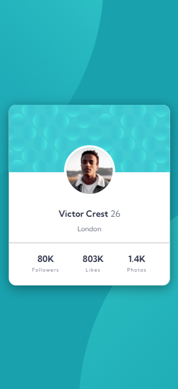
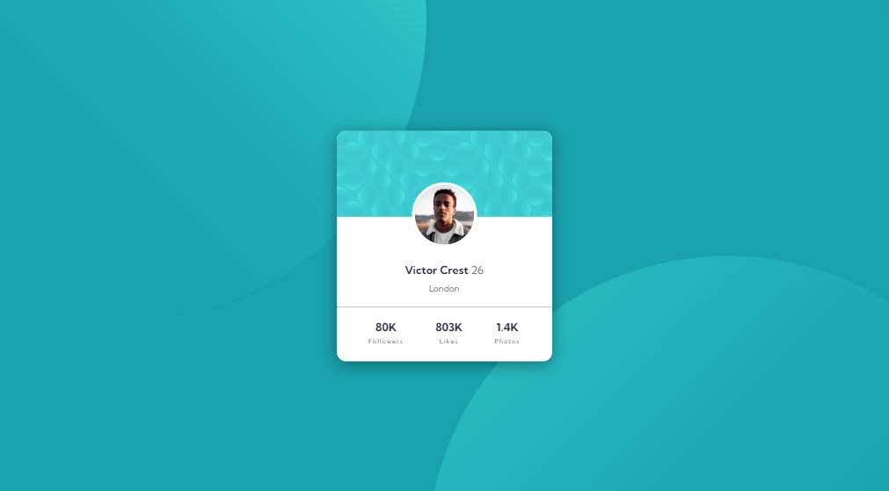

# Frontend Mentor - Huddle landing page with single introductory section solution

This is a solution to the [Profile card component challenge on Frontend Mentor](https://www.frontendmentor.io/challenges/profile-card-component-cfArpWshJ). Frontend Mentor challenges help you improve your coding skills by building realistic projects. 

### Goal :

## Table of contents

- [Overview](#overview)
  - [The challenge](#the-challenge)
  - [Screenshot](#screenshot)
  - [Links](#links)
- [My process](#my-process)
  - [Built with](#built-with)
  - [What I learned](#what-i-learned)
- [Author](#author)

# Overview

### The challenge

- Build out the project to the designs provided

### Screenshot

These are screenshots of the project in desktop and mobile states.

#### Mobile Preview :

#### Desktop Preview :

### Links
- Solution URL: [Check my solution on Frontend mentor here !]()
- Live Site URL: [Take a look at the site running here !](https://guisalva.github.io/frontendMentor-profile-card-component/)

# My process

### Built with

- Semantic HTML5 markup
- CSS custom properties
- CSS Flexbox
- [Google Fonts](https://fonts.google.com/)

### What I learned

With the developing of this project I could realize that I am able to use **View Height** and **View Width** when positioning the background image.
I could develop more my creativity and ability in creating flex layouts.

# Author

- GitHub - [GuiSalva](https://github.com/GuiSalva)
- Frontend Mentor - [@GuiSalva](https://www.frontendmentor.io/profile/GuiSalva)
- LinkedIn - [Guilherme Salvador](https://www.linkedin.com/in/oguilherme-salvador)
